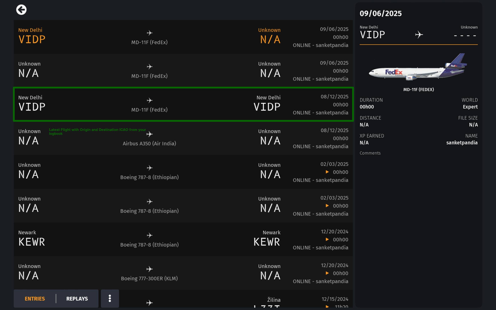

# Registration

Registration ties **one Discord account** to **one Infinite Flight Community (IFC) username**.
You must register before `/initserver` or before staff can treat you as a member of a VA on
Discord.

## What we ask for

- **IFC username** — your public Infinite Flight Community name.
- **Last flight proof** — origin and destination ICAO codes (for example `VIDP-VIDP`) matching
  **one of your last three** complete logbook flights in Infinite Flight.

We **never** ask for your Infinite Flight password, email, or full logbook export.

## Steps in Discord

1. Run `/register` in a server where Comrade Bot is installed.
2. Read the privacy notice — use only **your** IFC account.
3. Choose **Proceed** for a new account, or **Link to VA** if you already have a global account
   and only need to join this server’s VA.
4. Complete the modal with your IFC username and flight proof.

Politburo validates the flight against Infinite Flight data and rejects duplicate Discord or
IFC links.

## Joining a virtual airline

One Discord **guild** maps to one VA. If you are already registered and the server is a VA you
have not joined, `/register` can link you with your VA callsign (default role: pilot /
**proletariat**). Your roster in Airtable is matched by **IFC username**, not callsign alone.

## If registration fails

- **Already registered** — use `/status` or the **Link to VA** path.
- **IFC already linked to another Discord user** — we do not reveal the other account. You may
  report a possible impersonation; see [Roles & your VA](roles-and-va.md#reports).
- **Banned account** — registration is blocked for that Discord ID.

## Privacy

See our [Privacy policy](../legal/privacy.md) for what we store and why.
